# Ruler and Compass Constructions — Architecture Diagram

## File Relationship Diagram

```mermaid
flowchart TB
    %% ============================================
    %% Ruler and Compass Constructions — File Architecture
    %% ============================================

    %% === Shared Resources ===
    subgraph Shared["Shared Resources"]
        direction LR
        JS["rc-common.js\n—\nGeometry: dist, line_line,\nline_circle, circle_circle\nDrawing: draw_point, draw_segment,\ndraw_line, draw_arc\nEvents: handleMouseDown/Up/Move\nGlobals: canvas size, scale, point_radius"]
        CSS["constructions.css"]
    end

    %% === Hub Page ===
    Hub["default.html\n—\nMain Index / Hub Page\nLinks to ALL constructions"]
    Hub -->|script src| JS
    Hub -->|link rel=stylesheet| CSS

    %% === Construction Categories ===
    subgraph Basic["Basic Constructions (01-17)"]
        direction LR
        subgraph G1["Perpendiculars & Polygons"]
            F01["01-PerpBisector"]
            F02["02-PerpToLine"]
            F03["03-PerpAtPointOnLine"]
            F04["04-SquareOnSide"]
            F05["05-EquilateralTriangle"]
            F06["06-Hexagon"]
        end
        subgraph G2["Angles & Parallels"]
            F07["07-CopyAngle"]
            F08["08-ParallelThroughPoint"]
            F09["09-ThreeParts"]
            F10["10-AngleBisector"]
            F11["11-30-degree"]
            F12["12-ThreePointCircle"]
        end
        subgraph G3["Triangle Circles & Rectangles"]
            F13["13-TriangleCircumCircle"]
            F14["14-Incircle"]
            F15["15-Rectangle"]
            F16["16-SimilarTriangle"]
            F17["17-CopyRatio"]
        end
    end

    subgraph Advanced["Advanced Constructions (18-28)"]
        direction LR
        subgraph G4["Medians & Golden Ratio"]
            F18A["18A-Medians"]
            F18B["18B-Altitudes"]
            F19["19-GoldenRectangle"]
            F20["20-DoubledSquare"]
            F21["21-DoubledCircle"]
        end
        subgraph G5["Parallel Distance & Tangents"]
            F22["22-ParallelDistance"]
            F23["23-CircleInAngle"]
            F24["24-SquareRectangle"]
            F25["25-MirrorPoint"]
            F26["26-Reflection"]
            F27["27-TangentsToCircle"]
            F28["28-TangentCircle"]
        end
    end

    subgraph Expert["Expert Constructions (29-41)"]
        direction LR
        subgraph G6["Midlines & Circles"]
            F29["29-ParallelMidline"]
            F30["30-SquareThru4Points"]
            F31A["31A-CircleTangents"]
            F31B["31B-CircleTangentsInner"]
            F32["32-CircleTanParLinesCircle"]
        end
        subgraph G7["Angle & Point Circles"]
            F33["33-AngleCircTan"]
            F34["34-CircleAnglePoint"]
            F35["35-CircleInAngle"]
            F36["36-LinePointsCircle"]
            F37["37-PointCircleLine"]
        end
        subgraph G8["Multi-Circle & Regular Polygons"]
            F38["38-TwoCirclesLine"]
            F39["39-ThreeCircles"]
            F40["40-RegularPentagon"]
            F41["41-Regular-17-gon"]
        end
    end

    subgraph Standalone["Standalone Construction"]
        INV["Inversion.html\nPrev→01  Next→03"]
    end

    subgraph MathPages["Mathematical Explanation"]
        direction LR
        BG["big-gon.html\n—\nMathematical proofs\nfor constructible polygons"]
        TXT1["17-gon.m.txt"]
        TXT2["257-gon.m.txt"]
        TXT3["65537-gon.m.txt"]
        BG -->|references| TXT1
        BG -->|references| TXT2
        BG -->|references| TXT3
    end

    %% === CSS Dependencies ===
    BG -->|link rel=stylesheet| CSS

    %% === rc-common.js Dependencies (all construction pages) ===
    F01 & F02 & F03 & F04 & F05 & F06 -->|script src| JS
    F07 & F08 & F09 & F10 & F11 & F12 -->|script src| JS
    F13 & F14 & F15 & F16 & F17 -->|script src| JS
    F18A & F18B & F19 & F20 & F21 -->|script src| JS
    F22 & F23 & F24 & F25 & F26 & F27 & F28 -->|script src| JS
    F29 & F30 & F31A & F31B & F32 -->|script src| JS
    F33 & F34 & F35 & F36 & F37 -->|script src| JS
    F38 & F39 & F40 & F41 -->|script src| JS
    INV -->|script src| JS

    %% === Hub → All Constructions ===
    Hub ==>|"links to (41 pages)"| Basic
    Hub ==>|"links to"| Advanced
    Hub ==>|"links to"| Expert
    Hub ==>|"links to"| Standalone
    Hub ==>|"links to"| MathPages

    %% === Sequential Navigation Chain (group-to-group) ===
    G1 -->|"prev/next chain"| G2
    G2 -->|"prev/next chain"| G3
    G3 -->|"prev/next chain"| G4
    G4 -->|"prev/next chain"| G5
    G5 -->|"prev/next chain"| G6
    G6 -->|"prev/next chain"| G7
    G7 -->|"prev/next chain"| G8

    %% === Back Links ===
    Basic -.->|"back to hub"| Hub
    Advanced -.->|"back to hub"| Hub
    Expert -.->|"back to hub"| Hub
    Standalone -.->|"back to hub"| Hub
    MathPages -.->|"back to hub"| Hub

    %% === Data Flow per Construction Page ===
    subgraph DataFlow["Data Flow per Construction Page"]
        direction LR
        Define["Define local\npoints, circles,\nlines"] --> Calc["calc_points()\ncalls rc-common.js\ngeometry functions"]
        Calc --> Draw["draw()\ncalls rc-common.js\ndrawing functions"]
        Events["rc-common.js\nevent handlers\ndrag movable_pts"] --> Calc
    end

    %% === Styling ===
    classDef hub fill:#1a73e8,stroke:#0d47a1,color:#fff,font-weight:bold
    classDef shared fill:#34a853,stroke:#1e8e3e,color:#fff,font-weight:bold
    classDef math fill:#f9ab00,stroke:#e37400,color:#000
    classDef special fill:#ea4335,stroke:#c5221f,color:#fff
    classDef note fill:#f8f9fa,stroke:#dadce0,color:#202124

    class Hub hub
    class JS,CSS shared
    class BG,TXT1,TXT2,TXT3 math
    class INV special
    class DataFlow note
```

## Architecture Summary

| Layer | Files | Role |
|-------|-------|------|
| **Hub** | `default.html` | 主索引页，链接所有构建页面 |
| **Shared JS** | `rc-common.js` | 几何计算 + Canvas 绘图 + 鼠标事件处理 |
| **Shared CSS** | `constructions.css` | 全局样式 |
| **Basic (01-17)** | 17 个 HTML | 基础作图：垂线、多边形、角度、平行线 |
| **Advanced (18-28)** | 11 个 HTML | 进阶作图：中线、黄金矩形、切线 |
| **Expert (29-41)** | 13 个 HTML | 专家级作图：多圆相切、正多边形 |
| **Standalone** | `Inversion.html` | 独立构建：点关于圆的反演 |
| **Math** | `big-gon.html` + 3 个 `.m.txt` | 正 17/257/65537 边形的数学证明 |

### Each construction page follows the same pattern:
1. `<script src="rc-common.js">` 引入共享库
2. 定义局部几何对象（点、圆、线）
3. 定义 `movable_pts` 数组（可拖拽点）
4. `calc_points()` 调用 `rc-common.js` 的几何函数
5. `draw()` 调用 `rc-common.js` 的绘图函数
6. 步骤式单选按钮控制 `draw_stage`
7. 导航链接：返回主页 + 上一个/下一个构建
